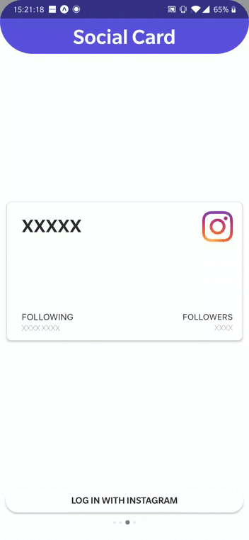

# SocialCard
 

 
Did you ever think that send your username/pseudonyme of your social network to your friend or one of your flirt, is boring  ? With Social Card you'll send your social card of your choice, it's more beautifull, more faster and more professional.

# Social Card APP
* We have written an app to offer you the possibility to create your social network card in one click.
* We communicate with the API from few social network to give you a modal to connect to your account and we catch your user info to create your card.
* We have an option as well to screenshot with the perfect size your card to send to the world who you are on Facebook and others.

# Technical informations

* App made in React native.
* Android works well on One Plus 6T/ IOS not yet tested.
* Card for social networks is a generic component and not a specific for each, it's a component made by me to create a card with thumbnail where you want or text to where you want in the corner.
* App made with expo as well and not with native method.
* Facebook OK.
* Linkedin OK.
* Instagram OK.
* Snapchat KO -> They won't give user info that's why I didn't made anything for this social network.
* Twitter OK/KO -> They pulled out my consumer key, but the code works before they was done that.

# Few card example : 

In the following gif you'll see few functionality of the app -->

# Facebook connexion + Facebook card
*

# Linkedin connexion + Linkedin card
*

# Instagram connexion + Instagram card
*

# Screenshot Functionality
*

# Installation

* npm install
* yarn start

Contact us for any claims.

